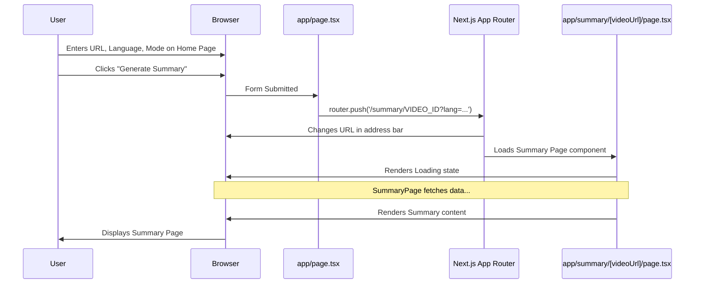

# Chapter 1: Frontend Pages (Next.js App Router)

Welcome to the Youtube Summarizer project! This is our first step into building the application that users will interact with. Think of this chapter as exploring the different rooms in our digital "house".

## What Are We Building Here? The "Rooms" of Our App

Imagine our Youtube Summarizer is a house. What rooms does it need?

1.  **An Entrance Hall (Home Page):** This is where visitors arrive. Here, they'll tell us which YouTube video they want summarized.
2.  **A Study (Summary Page):** This is the main workspace. After a user gives us a video URL, they come here to see the magic happen – the summary being generated and displayed.
3.  **An Archive Room (History Pages):** This is where we keep records of past summaries. Users can browse a list of summaries they've created or look at the details of a specific one.

In web development terms, these "rooms" are called **Frontend Pages**. They are the actual screens or views a user sees and interacts with in their web browser.

## Connecting the Rooms: The Next.js App Router

How do users move between these rooms (pages)? We need hallways! In our project, the **Next.js App Router** acts as these hallways. It's a feature of the Next.js framework that helps us define which "room" (page) to show based on the web address (URL) the user visits and handles moving between them.

## Key Ingredients

*   **React:** Think of React as the toolbox we use to build the *contents* of each room – the furniture, the decorations, the interactive elements (like buttons and input fields). It helps us create reusable UI pieces.
*   **Next.js:** Next.js is like the architect and builder for our house. It uses React (the toolbox) but provides the overall structure, including the foundation, walls, and importantly, the **App Router** (the hallways) to connect everything.

## Let's Peek Inside the Rooms (Pages)

Our project organizes these pages within an `app` folder. The structure inside `app` directly maps to the web addresses (URLs) a user visits.

**1. The Entrance Hall (`app/page.tsx`)**

This is the first page users see. Its main job is to collect information: the YouTube URL, the desired summary language, and the summary mode (video vs. podcast).

```typescript
// app/page.tsx (Simplified View)
"use client" // Important! Tells Next.js this page runs in the browser

import { useState } from "react"
import { useRouter } from "next/navigation" // Our "hallway" navigator
// ... other imports for input fields, buttons (UI components)

export default function Home() {
  const [url, setUrl] = useState("") // State to hold the URL input
  // ... other state variables for language, mode, model
  const router = useRouter() // Get access to the navigator

  const handleSubmit = (e: React.FormEvent) => {
    e.preventDefault() // Prevent default form submission
    // 1. Get the video ID from the URL
    // 2. Construct the URL for the summary page
    const summaryUrl = `/summary/VIDEO_ID_HERE?lang=en&mode=video&model=gemini`
    // 3. Tell the router to navigate to the summary page
    router.push(summaryUrl)
  }

  return (
    // JSX code defining the form with input fields and a submit button
    <form onSubmit={handleSubmit}>
      {/* Input for YouTube URL */}
      <input value={url} onChange={(e) => setUrl(e.target.value)} />
      {/* Select dropdowns for Language and Mode */}
      {/* Button to submit the form */}
      <button type="submit">Generate Summary</button>
    </form>
  )
}
```

*   **`"use client"`:** This special marker tells Next.js that this page needs to run in the user's browser because it involves interaction (like filling a form).
*   **`useState`:** A React feature to keep track of information that can change, like what the user types into the URL input.
*   **`useRouter`:** A Next.js hook (a special function) that gives us access to the navigation system (the "hallways").
*   **`handleSubmit`:** This function runs when the user clicks the "Generate Summary" button. It figures out where to go next (the summary page URL) and uses `router.push()` to navigate there.

**2. The Study (`app/summary/[videoUrl]/page.tsx`)**

This page is dynamic. The `[videoUrl]` part in the filename means the actual URL will include a specific video identifier. For example, `/summary/SOME_VIDEO_ID_HERE`. This page receives the video ID, language, and mode from the URL. Its job is to fetch and display the summary, showing a loading state first.

```typescript
// app/summary/[videoUrl]/page.tsx (Simplified View)
"use client"

import { useEffect, useState } from "react"
import { useSearchParams } from "next/navigation" // To read URL query params (?lang=...)
import { use } from "react" // To read the dynamic part of the URL ([videoUrl])

// Props type definition (simplified)
interface PageProps {
  params: Promise<{ videoUrl: string }>
}

export default function SummaryPage({ params }: PageProps) {
  const [summary, setSummary] = useState("") // State for the final summary
  const [loading, setLoading] = useState(true) // State to track loading
  const searchParams = useSearchParams() // Get access to ?lang=... etc.
  const { videoUrl } = use(params) // Get the video ID from the URL path

  useEffect(() => {
    // Function to fetch the summary from our backend API
    const fetchSummary = async () => {
      setLoading(true)
      // TODO: Call our backend API (covered in a later chapter!)
      // For now, imagine it gets the summary text
      const fetchedSummary = "This is the AI summary..."
      setSummary(fetchedSummary)
      setLoading(false)
    }

    fetchSummary() // Run the fetch function when the page loads
  }, [videoUrl]) // Re-run if the videoUrl changes

  if (loading) {
    return <div>Loading summary... Please wait.</div> // Show loading message
  }

  return (
    <div>
      <h1>Summary Result</h1>
      <p>{summary}</p> {/* Display the fetched summary */}
    </div>
  )
}
```

*   **`[videoUrl]`:** This signifies a dynamic segment in the URL path. Next.js makes this value available via the `params` prop.
*   **`useSearchParams`:** Another Next.js hook to read data from the query string part of the URL (e.g., `?lang=en`).
*   **`useEffect`:** A React hook that runs code after the page initially renders or when specific data (like `videoUrl`) changes. Here, it's used to trigger the fetching of the summary.
*   **Loading State:** The page shows a "Loading..." message while `loading` is `true`. Once the summary arrives, `loading` becomes `false`, and the summary is displayed.

**3. The Archive Rooms (`app/history/page.tsx` and `app/history/[id]/page.tsx`)**

*   **`app/history/page.tsx`:** This is the main archive room, showing a list of all previously generated summaries. It fetches this list from our backend.
*   **`app/history/[id]/page.tsx`:** This shows the detail of *one specific* summary, identified by `[id]` in the URL (e.g., `/history/123`). It fetches the details for that single summary.

These pages work similarly to the Summary page: they use `useEffect` to fetch data (either the list or the specific item) and display it, potentially showing a loading state first. They use `Link` components (from Next.js) or `router.push` to navigate between the list and detail views.

## How the App Router Knows Where to Go

The Next.js App Router uses a simple but powerful idea: **file-system based routing**.

*   A folder inside `app` creates a new URL path segment.
    *   `app/history/` maps to `/history`
*   A file named `page.tsx` inside a folder defines the content for that specific path.
    *   `app/page.tsx` maps to `/` (the home page)
    *   `app/history/page.tsx` maps to `/history`
*   Folders with square brackets like `[videoUrl]` or `[id]` create dynamic routes. The value in the URL at that position becomes available to the page.
    *   `app/summary/[videoUrl]/page.tsx` maps to `/summary/ANYTHING` (e.g., `/summary/dQw4w9WgXcQ`), and `dQw4w9WgXcQ` is passed to the page.

**The Overall Structure (`app/layout.tsx`)**

There's one more special file: `app/layout.tsx`. Think of this as the main blueprint for the *entire* house. It defines the common structure that *all* pages share, like the overall HTML structure, the sidebar navigation, and the header bar.

```typescript
// app/layout.tsx (Simplified View)
import "./globals.css" // Import global styles
import { Sidebar } from "@/components/sidebar" // Import the sidebar component

export default function RootLayout({
  children, // This prop represents the content of the specific page being rendered
}: {
  children: React.ReactNode
}) {
  return (
    <html lang="en">
      <body>
        <div className="flex h-screen">
          <aside className="w-64 border-r"> {/* Sidebar Area */}
            <Sidebar />
          </aside>
          <main className="flex-1 p-6"> {/* Main content area */}
            {children} {/* The actual page content goes here! */}
          </main>
        </div>
      </body>
    </html>
  )
}
```

*   **`children`:** This special prop holds the actual content of the current page (`page.tsx`) being displayed. The `layout.tsx` wraps around the `page.tsx`.

## Navigation Flow Example

Let's trace a user's journey:



## Conclusion

You've just toured the main "rooms" of our Youtube Summarizer application! You learned:

*   **Frontend Pages** are the user-facing views (Home, Summary, History).
*   **React** is used to build the UI elements within these pages.
*   **Next.js App Router** uses the `app` directory structure to handle navigation between pages based on URLs.
*   Special files like `page.tsx` define page content, and `layout.tsx` defines the shared structure.
*   Dynamic routes like `[videoUrl]` allow pages to handle variable data from the URL.

These pages provide the structure, but they need visual components like buttons, input fields, and cards to look good and be interactive. In the next chapter, we'll explore how we build these reusable UI pieces.

Next up: [UI Components (Shadcn/ui)](02_ui_components__shadcn_ui__.md)

---

Generated by [AI Codebase Knowledge Builder](https://github.com/The-Pocket/Tutorial-Codebase-Knowledge)