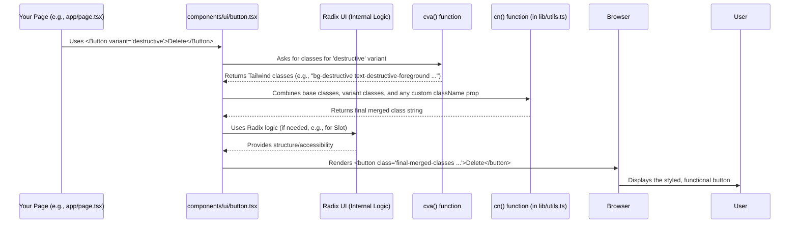

# Chapter 2: UI Components (Shadcn/ui)

Welcome back! In [Chapter 1: Frontend Pages (Next.js App Router)](01_frontend_pages__next_js_app_router__.md), we explored the different "rooms" or pages of our Youtube Summarizer application. We saw how Next.js helps us navigate between these pages. But pages are usually more than just blank spaces – they need buttons to click, forms to fill, and ways to display information nicely.

How do we make sure all the buttons look the same? How do we avoid building the same input field design over and over? That's where UI Components come in!

## What Problem Do UI Components Solve? Building with Lego Bricks!

Imagine you're building a house with Lego bricks. You wouldn't try to carve every single brick from scratch each time, right? You use standard Lego bricks – 2x4 red bricks, 1x2 blue bricks, special window pieces, door pieces, etc.

**UI Components are like these Lego bricks for our web application.**

Instead of designing a button from scratch every time we need one, we use a pre-designed `Button` component. Need a place for users to type text? We use an `Input` component. Need to display information in a neat box? We use a `Card` component.

Using these standard "bricks":

1.  **Saves Time:** We build faster because the basic design and functionality are already done.
2.  **Ensures Consistency:** All buttons look and feel like buttons, all inputs look like inputs. Our app looks professional and unified.
3.  **Makes Changes Easier:** If we want to change the style of all buttons (e.g., make them rounder), we only need to update the main `Button` component "blueprint", and the change applies everywhere it's used!

## Our Lego Brand: Shadcn/ui

There are many different "brands" or libraries of UI components (like different brands of building blocks). In this project, we're using a popular and modern approach called **Shadcn/ui**.

What makes Shadcn/ui special?

1.  **Built on Solid Foundations:** It uses two powerful tools underneath:
    *   **Radix UI:** Provides the core functionality and accessibility features for components (like how a dropdown menu opens and closes) without dictating the exact look. Think of it as providing the *shape* and *mechanics* of the Lego brick.
    *   **Tailwind CSS:** A utility-first CSS framework used to style the components. It gives us lots of small CSS building blocks (like `bg-blue-500` for a blue background or `p-4` for padding) that we combine to create the final look. Think of it as providing the *color* and *texture* stickers for our Lego bricks.

2.  **You Own the Code:** Unlike many libraries you just install and import, Shadcn/ui works differently. You use a command-line tool to *copy* the code for the components you need directly into your project (usually into a `components/ui` folder). This means:
    *   You have **full control** over the component's code and can easily customize it if needed.
    *   You only include the components you actually use, keeping your application lean.

## Using Shadcn/ui Components in Our Project

Let's see how we use these "Lego bricks" in our Youtube Summarizer pages.

**Example 1: The Button**

Remember the "Generate Summary" button on our Home Page ([Chapter 1: Frontend Pages (Next.js App Router)](01_frontend_pages__next_js_app_router__.md))? Instead of writing complex HTML and CSS for it, we just use the `Button` component.

```typescript
// Simplified snippet from app/page.tsx

import { Button } from "@/components/ui/button"; // Import the Button component

// ... inside the Home component's return statement ...

<Button type="submit">Generate Summary</Button>
```

*   We import `Button` from the `components/ui/button` file (where Shadcn/ui placed the code).
*   Using `<Button>...</Button>` gives us a nicely styled, functional button instantly!

**Example 2: The Input Field**

Similarly, for the YouTube URL input field:

```typescript
// Simplified snippet from app/page.tsx

import { Input } from "@/components/ui/input"; // Import the Input component
import { Label } from "@/components/ui/label"; // Optional: for nice labeling

// ... inside the Home component ...
const [url, setUrl] = useState(""); // State to hold the URL

// ... inside the return statement ...
<div>
  <Label htmlFor="youtube-url">YouTube URL</Label>
  <Input
    id="youtube-url"
    type="url"
    placeholder="https://www.youtube.com/watch?v=..."
    value={url}
    onChange={(e) => setUrl(e.target.value)} // Update state when user types
  />
</div>
```

*   We import and use the `Input` component. It handles the styling and basic input behavior.
*   We connect it to our React state (`url`, `setUrl`) to store what the user types.

**Example 3: The Select Dropdown**

For selecting the language or AI model, we use the `Select` component. It's actually made of several smaller component pieces working together:

```typescript
// Simplified snippet from components/ModelSelector.tsx

import {
  Select,
  SelectContent,
  SelectItem,
  SelectTrigger,
  SelectValue,
} from "@/components/ui/select"; // Import Select parts

// ... inside the ModelSelector component ...
<Select value={selectedModel} onValueChange={onModelChange}>
  <SelectTrigger> {/* The part you click to open */}
    <SelectValue placeholder="Select AI Model" />
  </SelectTrigger>
  <SelectContent> {/* The dropdown box that appears */}
    <SelectItem value="gemini">Google Gemini</SelectItem>
    <SelectItem value="groq">Groq</SelectItem>
    {/* ... more items ... */}
  </SelectContent>
</Select>
```

*   This looks more complex, but each part (`SelectTrigger`, `SelectContent`, `SelectItem`) has a specific job in creating a fully functional and accessible dropdown menu. Shadcn/ui provides these pre-built parts.

**Example 4: The Card**

When displaying summaries or history items, we might wrap them in a `Card` for better visual organization.

```typescript
// Hypothetical example for displaying a summary

import {
  Card,
  CardHeader,
  CardTitle,
  CardContent,
} from "@/components/ui/card"; // Import Card parts

// ... inside a component displaying a summary ...
<Card>
  <CardHeader>
    <CardTitle>Video Summary</CardTitle>
  </CardHeader>
  <CardContent>
    <p>{summaryText}</p> {/* The actual summary text goes here */}
  </CardContent>
</Card>
```

*   Like `Select`, `Card` uses helper components (`CardHeader`, `CardTitle`, `CardContent`) to structure the content within the card.

**Example 5: The Skeleton Loader**

While waiting for the summary to load (as seen in `app/summary/[videoUrl]/page.tsx` in Chapter 1), we can show `Skeleton` components as placeholders. They give a visual cue that content is coming.

```typescript
// Simplified snippet from app/summary/[videoUrl]/page.tsx (loading state)

import { Skeleton } from "@/components/ui/skeleton"; // Import Skeleton

// ... inside the SummaryPage component, when loading is true ...
if (loading) {
  return (
    <div className="space-y-4">
      <Skeleton className="h-8 w-1/4" /> {/* Placeholder for title */}
      <Skeleton className="h-4 w-full" /> {/* Placeholder for text line */}
      <Skeleton className="h-4 w-full" />
      <Skeleton className="h-4 w-3/4" />
    </div>
  );
}
```

*   The `Skeleton` component renders simple grey shapes that pulse gently, mimicking the layout of the content that will eventually load.

## How Shadcn/ui Works (A Peek Under the Hood)

Let's quickly look at how these components are built. When you run the Shadcn/ui command, say `npx shadcn-ui@latest add button`, it copies a file like this into your project:

```typescript
// Simplified version of components/ui/button.tsx

import * as React from "react"
import { Slot } from "@radix-ui/react-slot" // From Radix UI
import { cva, type VariantProps } from "class-variance-authority" // Helper library

import { cn } from "@/lib/utils" // Our utility for combining CSS classes

// 1. Define base styles and variants using Tailwind classes
const buttonVariants = cva(
  "inline-flex items-center justify-center rounded-md text-sm font-medium ...", // Base styles
  {
    variants: { // Different looks (e.g., primary, secondary, outline)
      variant: {
        default: "bg-primary text-primary-foreground shadow hover:bg-primary/90",
        destructive: "bg-destructive text-destructive-foreground ...",
        // ... other variants
      },
      size: { // Different sizes
        default: "h-9 px-4 py-2",
        sm: "h-8 rounded-md px-3 text-xs",
        // ... other sizes
      },
    },
    defaultVariants: { // Which variant/size to use if not specified
      variant: "default",
      size: "default",
    },
  }
)

// 2. Define the React component's properties (props)
export interface ButtonProps
  extends React.ButtonHTMLAttributes<HTMLButtonElement>,
    VariantProps<typeof buttonVariants> { // Include standard button attributes and our variants
  asChild?: boolean // Special prop from Radix Slot
}

// 3. Create the React component
const Button = React.forwardRef<HTMLButtonElement, ButtonProps>(
  ({ className, variant, size, asChild = false, ...props }, ref) => {
    const Comp = asChild ? Slot : "button" // Use Radix Slot if asChild is true
    return (
      <Comp
        // Combine base, variant, size, and custom classes smartly using cn()
        className={cn(buttonVariants({ variant, size, className }))}
        ref={ref}
        {...props} // Pass through any other standard button props
      />
    )
  }
)
Button.displayName = "Button" // For debugging tools

export { Button, buttonVariants } // Export the component
```

**Key Parts:**

1.  **`cva` (Class Variance Authority):** A small helper library used to define different visual variations (like `variant` and `size`) using Tailwind CSS classes.
2.  **`cn` (from `lib/utils.ts`):** Another helper function that intelligently merges Tailwind CSS classes. It uses `clsx` and `tailwind-merge` libraries. This prevents CSS conflicts (e.g., applying `p-2` and `p-4` results in only `p-4`).
3.  **`@radix-ui/react-slot`:** A component from Radix UI. If you pass `asChild={true}` to the `Button`, it merges its properties and behavior onto its direct child element instead of rendering its own `button` tag. This is useful for complex compositions, like wrapping an icon inside a link that should behave like a button.
4.  **React Component:** The core structure is a standard React functional component that takes properties (`props`) like `variant`, `size`, `className`, and standard HTML button attributes. It uses `cva` and `cn` to calculate the final CSS classes and renders either a `<button>` or a Radix `Slot`.

**How It Comes Together (Simplified Flow):**



This might seem like a lot, but the beauty is you usually don't need to worry about these internals! You just import the `Button` and use it. Shadcn/ui handles the complexity of combining functionality (Radix) and styling (Tailwind) for you, while still giving you the code if you need to tweak it.

## Conclusion

You've now learned about UI Components, our "Lego bricks" for building interfaces.

*   They provide **reusable**, **consistent**, and **maintainable** UI elements like buttons, inputs, cards, etc.
*   We use **Shadcn/ui**, which leverages **Radix UI** for functionality and **Tailwind CSS** for styling.
*   Shadcn/ui components are **copied into our project**, giving us full control.
*   We saw examples like `Button`, `Input`, `Select`, `Card`, and `Skeleton` used in our pages from [Chapter 1: Frontend Pages (Next.js App Router)](01_frontend_pages__next_js_app_router__.md).

With our application's structure (pages) and visual building blocks (UI components) in place, we can start thinking about the "brain" of the operation: the Artificial Intelligence models that will actually perform the summarization.

Next up: [Chapter 3: AI Model Abstraction & Selection](03_ai_model_abstraction___selection_.md)

---

Generated by [AI Codebase Knowledge Builder](https://github.com/The-Pocket/Tutorial-Codebase-Knowledge)