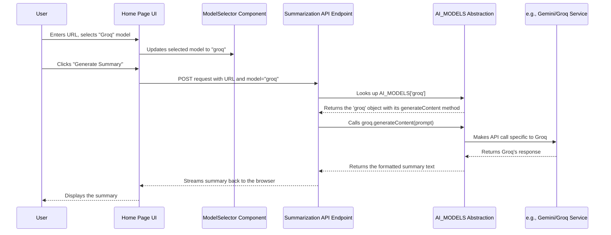

# Chapter 3: AI Model Abstraction & Selection

Welcome back! In [Chapter 2: UI Components (Shadcn/ui)](02_ui_components__shadcn_ui__.md), we learned how to build the visual parts of our application using reusable "Lego bricks" like buttons and inputs. Now, let's dive into the "brain" behind the summarization feature: the Artificial Intelligence (AI) models.

Our Youtube Summarizer aims to be flexible. We don't want to be locked into using just *one* specific AI. Maybe today, Google's Gemini is the best choice, but tomorrow we might prefer Groq for its speed, or OpenAI's GPT-4 for certain tasks. How can we easily switch between these different AI services without rewriting large parts of our code each time?

This chapter introduces the concept of **AI Model Abstraction & Selection**, which provides a clever way to manage and use multiple AI models seamlessly.

## The Problem: Managing Different AI Experts

Imagine you're managing a project and need expert advice. You have several consultants available:

*   **Consultant G (Gemini):** Very knowledgeable, communicates in a specific way.
*   **Consultant Q (Groq):** Extremely fast, has their own way of being briefed.
*   **Consultant O (GPT-4):** Highly detailed, requires instructions formatted differently.

If you talk to each consultant directly, you need to remember exactly how each one likes to be contacted and briefed. If a new consultant becomes available, you have to learn their specific process too. This can get complicated quickly!

In our app, the different AI services (Gemini, Groq, GPT-4) are like these expert consultants. Each has its own Application Programming Interface (API) – a specific set of rules and formats for how to send requests and receive responses.

## The Solution: The "AI Project Manager" (Abstraction)

Instead of talking to each consultant directly, what if you hired a **Project Manager**?

*   You tell the Project Manager, "I need a summary of this document." (A single, consistent request).
*   The Project Manager knows which consultants are available (maybe Consultant Q is on vacation – their API key isn't configured).
*   The Project Manager takes your request and briefs the chosen consultant *in the specific way that consultant understands*.
*   The Project Manager gets the result back from the consultant and gives it to you.

This "Project Manager" is exactly what our **AI Model Abstraction** does in the code. It's a layer that sits between the main part of our application and the different AI services.

**Key Ideas:**

1.  **Abstraction:** Hiding the complex details. Our main application doesn't need to know the *specific* API details for Gemini or Groq; it just talks to the "Project Manager".
2.  **Common Interface:** The "Project Manager" defines one standard way to ask for a summary. In our code, this is a function usually called something like `generateContent`.
3.  **Selection:** The system allows the user (or the application) to choose which available "consultant" (AI model) they want to use for a specific task.

## How it Works in Our Code

Let's peek inside the "Project Manager's" office, located mainly in our backend API code ([Chapter 4: Summarization API Endpoint](04_summarization_api_endpoint_.md)).

**1. Defining the Experts and Their Briefing Methods (`app/api/summarize/route.ts`)**

We create an object that lists our available AI "consultants" and defines the *one* standard way (`generateContent`) to ask them for help. Inside each `generateContent` function, the "Project Manager" performs the specific steps needed to talk to that particular AI service.

```typescript
// Simplified structure in app/api/summarize/route.ts

// Function to get the Gemini client (only if key exists)
function getGeminiClient() { /* ... checks env var, returns client ... */ }
// Function to get the Groq client (only if key exists)
function getGroqClient() { /* ... checks env var, returns client ... */ }
// ... other clients ...

// Our "Project Manager's" list of experts
const AI_MODELS = {
  gemini: { // Consultant G
    name: "gemini",
    // The standard briefing method
    async generateContent(prompt: string) {
      const genAI = getGeminiClient(); // Get specific client
      if (!genAI) throw new Error("Gemini key missing!");
      // ... specific Gemini API call details ...
      const result = await model.generateContent(prompt);
      return result.response.text(); // Return the text result
    }
  },
  groq: { // Consultant Q
    name: "groq",
    model: "llama-3.3-70b-versatile", // Specific model for Groq
    // The SAME standard briefing method name
    async generateContent(prompt: string) {
      const groq = getGroqClient(); // Get specific client
      if (!groq) throw new Error("Groq key missing!");
      // ... specific Groq API call details (different from Gemini!) ...
      const completion = await groq.chat.completions.create({ /* ... */ });
      return completion.choices[0]?.message?.content || ''; // Return result
    }
  },
  // ... potentially gpt4 entry ...
};
```

*   **`AI_MODELS`:** This object acts as the directory of our AI "consultants".
*   **`gemini` / `groq`:** Each key represents a specific AI model.
*   **`generateContent(prompt: string)`:** This is the **common interface**. Notice both `gemini` and `groq` have a function with this *exact name and input type* (it takes a `prompt` string).
*   **Inside `generateContent`:** The code *inside* each function is different! It uses the specific client library and makes the API call unique to that service (e.g., `genAI.getGenerativeModel` vs `groq.chat.completions.create`). This is the abstraction – the complexity is hidden inside.

**2. Checking Who's Available (API Keys)**

The "Project Manager" needs to know which consultants are actually reachable. We check if the necessary API keys (like secret phone numbers) have been configured in our application's settings (environment variables).

```typescript
// Simplified function in app/api/summarize/route.ts

function checkApiKeyAvailability() {
  return {
    gemini: !!process.env.GEMINI_API_KEY, // Is the Gemini key set? (true/false)
    groq: !!process.env.GROQ_API_KEY,     // Is the Groq key set? (true/false)
    gpt4: !!process.env.OPENAI_API_KEY    // Is the GPT-4 key set? (true/false)
  };
}
```

*   `process.env.GEMINI_API_KEY`: Accesses the environment variable where the user stores their Gemini API key.
*   `!!`: A quick JavaScript trick to convert a value (like the key string or `undefined`) into a boolean (`true` or `false`).
*   This function returns an object telling us which models *could* be used because their keys are present.

**3. Letting the User Choose (Frontend Component)**

On the website's home page, we need a way for the user to select which AI model they want to use. We use a UI component for this, which we saw briefly in [Chapter 2: UI Components (Shadcn/ui)](02_ui_components__shadcn_ui__.md).

This component (`components/ModelSelector.tsx`) first asks the backend which models are *actually* available (using the `checkApiKeyAvailability` function via an API call).

```typescript
// Simplified logic in components/ModelSelector.tsx

function ModelSelector({ selectedModel, onModelChange }) {
  const [modelAvailability, setModelAvailability] = useState(null);
  const [isLoading, setIsLoading] = useState(true);

  useEffect(() => {
    // Ask the backend which models have API keys configured
    fetch('/api/summarize') // Makes a GET request to our API
      .then(res => res.json())
      .then(data => {
        setModelAvailability(data); // Store { gemini: true, groq: false, ... }
        setIsLoading(false);
      });
  }, []);

  // ... (render loading state if isLoading) ...

  // Render the Shadcn Select component
  return (
    <Select onValueChange={onModelChange} value={selectedModel}>
      <SelectTrigger>...</SelectTrigger>
      <SelectContent>
        {/* Map over available models and create SelectItem options */}
        {/* Only enable options where modelAvailability[key] is true */}
      </SelectContent>
    </Select>
  );
}
```

*   **`useEffect` / `fetch`:** When the component loads, it calls our backend API (`/api/summarize` using the GET method). The backend runs `checkApiKeyAvailability` and sends back the results.
*   **`modelAvailability` state:** Stores the fetched availability (e.g., `{ gemini: true, groq: true, gpt4: false }`).
*   **`Select` / `SelectItem`:** The component uses this availability data to build the dropdown menu. Models without a configured API key will be shown as disabled (greyed out).

## The Workflow: From User Choice to AI Response

Let's trace the steps when a user requests a summary:



**Inside the Backend API (`app/api/summarize/route.ts`)**

When the request arrives at the backend, the code finds the right "expert" object based on the user's choice and calls its standard `generateContent` method.

```typescript
// Simplified snippet from the POST handler in app/api/summarize/route.ts

export async function POST(req: Request) {
  // ... setup stream ...

  try {
    // 1. Get user input, including the chosen model
    const { url, language, mode, aiModel = 'gemini' } = await req.json();
    const videoId = extractVideoId(url);

    // 2. Find the correct "expert" object using the abstraction
    const selectedModel = AI_MODELS[aiModel as keyof typeof AI_MODELS];
    if (!selectedModel) {
      throw new Error("Invalid AI model selected.");
    }

    // ... get transcript, prepare prompt ...
    const prompt = createSummaryPrompt(/* ... */);

    // 3. Use the standard method - no need to know if it's Gemini or Groq here!
    await writeProgress({ message: `Asking ${aiModel} to summarize...`});
    const summary = await selectedModel.generateContent(prompt); // <--- The Magic!

    // ... save summary, stream response ...

  } catch (error) {
    // ... handle errors ...
  } finally {
    // ... close stream ...
  }

  // ... return Response ...
}
```

*   **Step 1:** Get the `aiModel` identifier (e.g., "gemini", "groq") sent from the frontend.
*   **Step 2:** Look up the corresponding object in our `AI_MODELS` directory.
*   **Step 3:** Call the `generateContent` function on the `selectedModel` object. The beauty here is that the code *doesn't care* if `selectedModel` refers to the Gemini object or the Groq object. It just calls the agreed-upon function name. The specific API logic is hidden *inside* that function, thanks to our abstraction.

## Conclusion

You've learned how our Youtube Summarizer cleverly manages different AI models using **Abstraction and Selection**:

*   **Abstraction** (the "Project Manager") hides the unique complexities of each AI service API.
*   A **Common Interface** (`generateContent`) provides a single, consistent way to ask any model for a summary.
*   **API Key Checking** determines which models are actually available to use.
*   A **Frontend Selector** (`ModelSelector`) allows the user to choose from the available models based on the detected keys.
*   This makes the system **flexible** (easy to add new models) and **maintainable** (changes to one model's API don't break others).

Now that we understand how we can talk to different AIs, let's look closely at the main backend endpoint that orchestrates the whole summarization process, from receiving the user's request to sending back the final summary.

Next up: [Chapter 4: Summarization API Endpoint](04_summarization_api_endpoint_.md)

---

Generated by [AI Codebase Knowledge Builder](https://github.com/The-Pocket/Tutorial-Codebase-Knowledge)