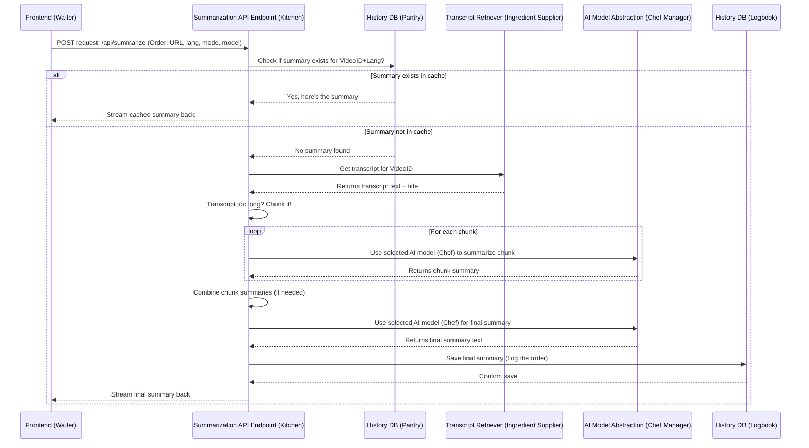

# Chapter 4: Summarization API Endpoint

Welcome back! In [Chapter 3: AI Model Abstraction & Selection](03_ai_model_abstraction___selection_.md), we learned how our application can flexibly use different AI "consultants" like Gemini or Groq thanks to a clever "Project Manager" abstraction.

But where does this "Project Manager" work? Who tells it which video to summarize, which language to use, and which AI consultant to brief? We need a central hub that takes the user's request from the website and orchestrates the entire summarization process.

That's where the **Summarization API Endpoint** comes in. Think of it as the **central kitchen** in our Youtube Summarizer restaurant.

## What's the "Central Kitchen" For?

Imagine you order food at a restaurant. You give your order (YouTube URL, language, model choice) to the waiter (our [Frontend Pages](01_frontend_pages__next_js_app_router__.md)). The waiter takes this order to the central kitchen (the API endpoint).

What happens in the kitchen?

1.  **Order Received:** The kitchen receives the order slip (the request data).
2.  **Check Pantry:** It quickly checks if this exact meal (summary) has been made recently and stored (cache check).
3.  **Gather Ingredients:** If not cached, it fetches the main ingredient – the video's transcript ([Chapter 5: Transcript Retrieval](05_transcript_retrieval_.md)).
4.  **Prepare Ingredients:** If the transcript is very long (like a huge recipe), it breaks it down into manageable portions (chunking).
5.  **Choose Chef:** It identifies the requested chef (the selected AI model from [Chapter 3: AI Model Abstraction & Selection](03_ai_model_abstraction___selection_.md)).
6.  **Cooking Instructions:** It gives the chef clear instructions (the prompt, see [Chapter 6: Prompt Engineering](06_prompt_engineering_.md)) on how to prepare the meal based on the order (e.g., "summarize this transcript chunk").
7.  **Assemble Meal:** If the meal was cooked in portions (chunking), it assembles the final dish (combines intermediate summaries).
8.  **Log Order:** It records the finished meal in the kitchen's logbook ([Chapter 7: History Persistence (Prisma + SQLite)](07_history_persistence__prisma___sqlite__.md)).
9.  **Serve Meal:** It sends the finished summary back to the waiter (frontend) to be presented to you, often piece by piece as it's ready (streaming).

This "kitchen" – the Summarization API Endpoint – is the core backend logic that makes everything happen.

## What is an API Endpoint?

In simple terms, an **API Endpoint** is a specific web address (URL) on our server that our frontend application can talk to. When our frontend ([Chapter 1: Frontend Pages (Next.js App Router)](01_frontend_pages__next_js_app_router__.md)) needs the backend to do something (like generate a summary), it sends a message (an HTTP request) to this specific address.

In our Next.js project, API endpoints are often defined inside the `app/api` directory. Our main endpoint lives in `app/api/summarize/route.ts`.

## The Workflow: Step-by-Step in the Kitchen

Let's follow an order (a user request) through our kitchen (`app/api/summarize/route.ts`):



**Key Steps:**

1.  **Receive Request:** The endpoint gets a `POST` request from the frontend containing the YouTube URL, language, summary mode, and chosen AI model.
2.  **Extract Video ID:** It pulls the unique video identifier from the YouTube URL.
3.  **Check Cache:** It asks the database ([Chapter 7: History Persistence (Prisma + SQLite)](07_history_persistence__prisma___sqlite__.md)) if a summary for this specific video ID and language already exists. If yes, it sends it back immediately!
4.  **Fetch Transcript:** If not cached, it calls the logic responsible for getting the video's text transcript ([Chapter 5: Transcript Retrieval](05_transcript_retrieval_.md)). This might involve fetching subtitles directly from YouTube or using AI (like Whisper) to transcribe the audio.
5.  **Chunk Transcript (If Needed):** AI models have limits on how much text they can process at once (context window). If the transcript is longer than the limit (e.g., > 7000 characters), the endpoint splits it into smaller, overlapping chunks.
6.  **Process Chunks (If Needed):** If chunking occurred, it asks the selected AI model ([Chapter 3: AI Model Abstraction & Selection](03_ai_model_abstraction___selection_.md)) to summarize *each chunk* individually.
7.  **Generate Final Summary:** It combines the intermediate summaries (if chunked) or uses the full transcript (if short) and sends it to the AI model with a final prompt ([Chapter 6: Prompt Engineering](06_prompt_engineering_.md)) to create the definitive summary in the desired language and style (mode).
8.  **Save to History:** The final summary, along with video details, is saved to the database ([Chapter 7: History Persistence (Prisma + SQLite)](07_history_persistence__prisma___sqlite__.md)).
9.  **Stream Response:** The endpoint sends the results back to the frontend. Crucially, it does this using **streaming**.

## Peeking at the Code (`app/api/summarize/route.ts`)

Let's look at simplified snippets of the `POST` handler function in `app/api/summarize/route.ts`. This function runs when the frontend sends a summarization request.

**1. Setting up the Kitchen and Receiving the Order:**

```typescript
// app/api/summarize/route.ts (Simplified)
import { NextResponse } from "next/server";
import { extractVideoId } from '@/lib/youtube';
// ... other necessary imports (prisma, getTranscript, AI_MODELS)

export async function POST(req: Request) {
  // Setup for streaming responses back to the frontend
  const encoder = new TextEncoder();
  const stream = new TransformStream();
  const writer = stream.writable.getWriter();

  // Helper function to send progress updates via the stream
  const writeProgress = async (data: any) => {
    await writer.write(encoder.encode(JSON.stringify(data) + '\n'));
  };

  // Start processing in the background so we can return the stream immediately
  (async () => {
    try {
      // Get the order details from the request
      const { url, language, mode, aiModel = 'gemini' } = await req.json();
      const videoId = extractVideoId(url);
      // ... rest of the logic inside this async block ...
```

*   **`POST(req: Request)`:** This function handles incoming POST requests to `/api/summarize`.
*   **`TransformStream`, `writer`, `encoder`:** These are tools from the web platform used to create a stream. Think of it like setting up a conveyor belt to send updates back to the frontend.
*   **`writeProgress`:** A helper function to put messages onto the conveyor belt.
*   **`(async () => { ... })();`:** This starts the main summarization work in the background, allowing the function to immediately return the `stream` to the frontend.
*   **`await req.json()`:** Parses the data sent from the frontend (URL, language, etc.).
*   **`extractVideoId(url)`:** A helper function to get the ID from the YouTube link.

**2. Gathering Ingredients and Choosing the Chef:**

```typescript
      // ... inside the async block ...
      await writeProgress({ message: 'Fetching video transcript...' });

      // Call the transcript retrieval logic (Chapter 5)
      const { transcript, source, title } = await getTranscript(videoId);

      // Choose the AI Chef based on user selection (Chapter 3)
      const selectedModel = AI_MODELS[aiModel as keyof typeof AI_MODELS];
      if (!selectedModel) {
        throw new Error("Invalid AI model selected.");
      }
      await writeProgress({ message: `Using ${selectedModel.name}...` });
```

*   **`writeProgress`:** Sends status updates back to the frontend via the stream.
*   **`getTranscript(videoId)`:** Calls the function (detailed in [Chapter 5: Transcript Retrieval](05_transcript_retrieval_.md)) that fetches or generates the transcript.
*   **`AI_MODELS[aiModel]`:** Selects the correct AI model object using the abstraction layer from [Chapter 3: AI Model Abstraction & Selection](03_ai_model_abstraction___selection_.md).

**3. Preparing the Meal (Chunking and Summarizing):**

```typescript
      // ... inside the async block ...
      // Split into chunks if transcript is long (implementation simplified)
      const chunks = await splitTranscriptIntoChunks(transcript);
      const totalChunks = chunks.length;
      let finalSummaryText = "";

      if (totalChunks > 1) {
          // Summarize each chunk (simplified loop)
          const intermediateSummaries = [];
          for (let i = 0; i < chunks.length; i++) {
            await writeProgress({ message: `Processing section ${i+1}...` });
            const chunkPrompt = `Summarize this part: ${chunks[i]}`;
            const chunkSummary = await selectedModel.generateContent(chunkPrompt);
            intermediateSummaries.push(chunkSummary);
          }
          // Combine intermediate summaries for the final step
          const combined = intermediateSummaries.join(" ");
          const finalPrompt = createSummaryPrompt(combined, language, mode); // Chapter 6
          finalSummaryText = await selectedModel.generateContent(finalPrompt);
      } else {
          // If short, summarize directly
          await writeProgress({ message: 'Generating summary...' });
          const prompt = createSummaryPrompt(transcript, language, mode); // Chapter 6
          finalSummaryText = await selectedModel.generateContent(prompt);
      }
```

*   **`splitTranscriptIntoChunks`:** Breaks down long text.
*   **Loop (Simplified):** If chunked, it iterates, asking the AI (`selectedModel.generateContent`) to summarize each piece.
*   **`createSummaryPrompt`:** Creates the specific instructions for the AI (covered in [Chapter 6: Prompt Engineering](06_prompt_engineering_.md)).
*   **`selectedModel.generateContent(prompt)`:** The core call to the selected AI model via our abstraction layer.

**4. Logging and Serving the Meal:**

```typescript
      // ... inside the async block ...
      await writeProgress({ message: 'Saving summary...' });

      // Save the final result to the database (Chapter 7)
      const savedSummary = await prisma.summary.create({
          data: { videoId, title, content: finalSummaryText, language, mode, source }
      });

      // Send the final summary back via the stream
      await writeProgress({
          type: 'complete',
          summary: savedSummary.content,
          source: savedSummary.source,
          status: 'completed'
      });

    } catch (error: any) {
      // Handle any errors in the kitchen
      await writeProgress({ type: 'error', error: error.message });
    } finally {
      // Close the stream (conveyor belt) when done or if error occurs
      await writer.close();
    }
  })(); // End of the async background processing block

  // Return the stream immediately so the frontend can listen for updates
  return new Response(stream.readable, {
    headers: { 'Content-Type': 'text/event-stream' /* ... */ },
  });
}
```

*   **`prisma.summary.create`:** Saves the result using Prisma (covered in [Chapter 7: History Persistence (Prisma + SQLite)](07_history_persistence__prisma___sqlite__.md)).
*   **`writeProgress({ type: 'complete', ... })`:** Sends the final summary.
*   **`catch (error)`:** Handles problems during the process.
*   **`finally { writer.close(); }`:** Ensures the stream is closed properly.
*   **`return new Response(stream.readable, ...)`:** This is key! The API endpoint immediately returns the *readable* end of the stream to the frontend, allowing real-time updates.

## Why Stream the Response?

Imagine ordering a complex meal. Instead of waiting 30 minutes with no updates, wouldn't it be better if the waiter occasionally told you "The chef is chopping vegetables," "The sauce is simmering," "Plating now!"?

That's what streaming does. By sending small updates (`writeProgress`) over the stream (`stream.readable`), the API endpoint keeps the frontend informed about the progress: "Fetching transcript...", "Processing chunk 2 of 5...", "Generating final summary...". This provides a much better user experience than showing a static loading spinner for potentially a long time, especially when using slower models or transcribing long videos.

## Conclusion

You've now explored the heart of our backend: the **Summarization API Endpoint** (`/api/summarize`). It acts as the central kitchen, orchestrating the entire process:

*   Receives the user's order (request).
*   Coordinates fetching ingredients (transcript).
*   Manages different chefs (AI models via abstraction).
*   Handles large orders (chunking).
*   Prepares the final meal (summary).
*   Logs the order (saves to history).
*   Keeps the user updated via **streaming**.

This endpoint connects many different parts of our application. One crucial part is getting the actual text content from the YouTube video. How does that work? Let's dive into that next.

Next up: [Chapter 5: Transcript Retrieval](05_transcript_retrieval_.md)

---

Generated by [AI Codebase Knowledge Builder](https://github.com/The-Pocket/Tutorial-Codebase-Knowledge)