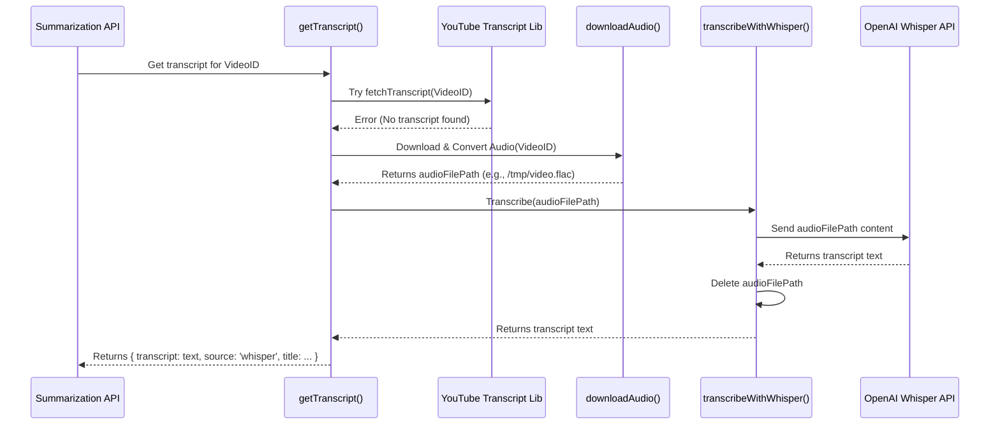

# Chapter 5: Transcript Retrieval

Welcome back! In [Chapter 4: Summarization API Endpoint](04_summarization_api_endpoint_.md), we explored the "central kitchen" of our application, where the user's request is received and the whole summarization process is managed. We saw that a crucial first step in the kitchen is gathering the main ingredient: the text content, or **transcript**, of the YouTube video.

But how do we actually get that text? YouTube videos are primarily visual and auditory. This chapter dives into the **Transcript Retrieval** component, which is responsible for extracting the spoken words from the video.

## What's the Problem? Finding the Video's Script

Imagine you want to summarize a speech someone gave. The easiest way would be to find an official written script they prepared beforehand. But what if there isn't one? Your next best option would be to get an audio recording of the speech and then carefully type out everything that was said – or hire someone to do it for you.

Getting the text from a YouTube video is very similar:

1.  **Check for an Official Script:** Many YouTube videos have official captions or transcripts provided by the creator or automatically generated by YouTube. This is the best and fastest source if available.
2.  **Create a Script from Audio:** If no official transcript exists, we need to "listen" to the video's audio and convert the spoken words into text. This process is called **transcription**.

Our Transcript Retrieval component acts like a diligent researcher trying to find or create this script.

## Our Strategy: YouTube First, AI Transcription Second

Our application uses a two-step strategy to get the transcript:

**Plan A: Use the Official YouTube Transcript**

*   We first try to fetch the captions/transcript directly from YouTube using a specialized library (`youtube-transcript`).
*   **Pros:** Fast, usually accurate (especially if creator-provided), and doesn't cost anything extra.
*   **Cons:** Not always available for every video or every language.

**Plan B: Use AI Transcription (Whisper)**

*   If Plan A fails (no transcript found on YouTube), we switch to Plan B.
*   This involves:
    1.  **Downloading:** Getting just the audio track of the YouTube video (using a library like `ytdl-core`).
    2.  **Converting (Optional but Recommended):** Changing the audio format to one that the transcription AI works best with (e.g., FLAC, using tools like `ffmpeg`).
    3.  **Transcribing:** Sending the audio file to an AI model specialized in speech-to-text, like OpenAI's **Whisper**. Whisper "listens" to the audio and generates the text transcript.
*   **Pros:** Works for almost any video with spoken words, can often detect the language automatically.
*   **Cons:** Slower (downloading + AI processing takes time), requires an API key for the AI service (like OpenAI), and might incur costs depending on the service's pricing.

## How it Works in Our Code: The `getTranscript` Function

The "central kitchen" ([Chapter 4: Summarization API Endpoint](04_summarization_api_endpoint_.md)) doesn't need to know all these details. It just calls a single function, let's call it `getTranscript`, and tells it the `videoId`. This function handles the two-step strategy internally.

Let's look at a simplified version of this function (found within `app/api/summarize/route.ts` in the full code):

**1. Trying Plan A (YouTube Transcript):**

```typescript
// Simplified getTranscript function
import { YoutubeTranscript } from 'youtube-transcript';
// ... other imports for fallback logic ...

async function getTranscript(videoId: string): Promise<{ transcript: string; source: 'youtube' | 'whisper'; title: string }> {
  try {
    // == PLAN A ==
    logger.info(`Attempting to fetch YouTube transcript for video ${videoId}`);
    // Use the library to fetch transcript from YouTube
    const transcriptList = await YoutubeTranscript.fetchTranscript(videoId);

    // If successful, process it and get the video title somehow (simplified)
    const transcriptText = transcriptList.map(item => item.text).join(' ');
    const videoTitle = "Video Title From YouTube"; // Logic to get title omitted

    logger.info('Successfully retrieved YouTube transcript');
    // Return the transcript, mark the source as 'youtube'
    return { transcript: transcriptText, source: 'youtube', title: videoTitle };

  } catch (error) {
    // If Plan A failed, move to Plan B...
    logger.info('YouTube transcript failed, falling back to Whisper...');
    // ... code for Plan B (Whisper) goes here ...
  }
}
```

*   **`import { YoutubeTranscript } ...`:** We bring in the tool specifically designed to get transcripts from YouTube.
*   **`try { ... } catch (error) { ... }`:** This is a standard way in programming to attempt something that might fail. If the code inside `try` works, the `catch` part is skipped. If it fails (throws an `error`), the code inside `catch` runs.
*   **`YoutubeTranscript.fetchTranscript(videoId)`:** This is the core command to ask the library to get the transcript from YouTube for the given `videoId`.
*   **`return { ... source: 'youtube', ... }`:** If successful, the function returns the text and clearly marks that it came from YouTube.

**2. Executing Plan B (Whisper Fallback in the `catch` block):**

```typescript
// ... inside the catch block of getTranscript ...
catch (error) {
    logger.info('YouTube transcript failed, falling back to Whisper...');

    // == PLAN B ==
    try {
        // Step 1: Get video info (like the title) using another library
        const videoInfo = await ytdl.getInfo(videoId);
        const title = videoInfo.videoDetails.title;
        logger.info(`Video title for Whisper path: ${title}`);

        // Step 2: Download the audio (this function handles download & conversion)
        await writeProgress({ message: 'Downloading audio for analysis...' }); // Update frontend
        const audioPath = await downloadAudio(videoId); // Returns path to audio file

        // Step 3: Transcribe the audio using Whisper AI
        await writeProgress({ message: 'Analyzing audio with Whisper...' }); // Update frontend
        const transcriptText = await transcribeWithWhisper(audioPath); // Returns text

        logger.info('Successfully transcribed audio with Whisper');
        // Return the transcript, mark the source as 'whisper'
        return { transcript: transcriptText, source: 'whisper', title: title };

    } catch (fallbackError) {
        // If Plan B also fails, report the error
        logger.error('Whisper fallback failed:', fallbackError);
        throw new Error(`Failed to get transcript from both YouTube and Whisper.`);
    }
} // End of the main catch block
```

*   **Inside `catch`:** This code only runs if `YoutubeTranscript.fetchTranscript` failed.
*   **`ytdl.getInfo(videoId)`:** We use a different tool (`ytdl-core`) to get video details like the title, as we still need it.
*   **`downloadAudio(videoId)`:** This is a separate helper function (explained below) that downloads the audio track and saves it temporarily (e.g., as a `.flac` file). We send progress updates to the frontend.
*   **`transcribeWithWhisper(audioPath)`:** Another helper function (explained below) that takes the path to the audio file, sends it to the OpenAI Whisper API, and gets the text back.
*   **`return { ... source: 'whisper', ... }`:** If the fallback is successful, we return the text generated by Whisper and mark the source accordingly.
*   **Nested `try...catch`:** We wrap Plan B in its own `try...catch` in case the download or transcription fails.

## A Peek Inside Plan B: Downloading and Transcribing

Let's briefly touch on the helper functions used in Plan B.

**1. `downloadAudio(videoId)`:**

*   Uses the `ytdl-core` library to find and download the best *audio-only* stream for the video.
*   Saves this audio to a temporary file on the server (e.g., in a `/tmp` directory).
*   Uses a command-line tool called `ffmpeg` (which needs to be installed on the server) to convert the downloaded audio into a format Whisper prefers, like FLAC ( `.flac`). This often improves Whisper's accuracy.
*   Cleans up the original downloaded file, leaving only the converted FLAC file.
*   Returns the file path of the final audio file (e.g., `/tmp/VIDEO_ID.flac`).

**2. `transcribeWithWhisper(audioPath)`:**

*   Takes the path to the audio file (e.g., `/tmp/VIDEO_ID.flac`).
*   Uses the official OpenAI client library (`openai`).
*   Reads the audio file from the server's disk.
*   Sends the audio data to the OpenAI Whisper API endpoint, specifying the model (`whisper-1`).
*   Receives the transcribed text back from OpenAI.
*   **Important:** Deletes the temporary audio file from the server to save space after transcription is complete.
*   Returns the final transcript text.

**Flow Diagram for Plan B (Whisper Fallback):**



This diagram shows the sequence: the API asks `getTranscript`, YouTube fails, `downloadAudio` gets the file, `transcribeWithWhisper` sends it to OpenAI, gets the text back, cleans up, and returns the result.

## Conclusion

You've learned how our Youtube Summarizer cleverly retrieves the necessary text transcript for any video:

*   It employs a **two-step strategy**: Try the fast and free official **YouTube transcript** first.
*   If that fails, it falls back to a more robust method: **downloading the audio** and using **OpenAI's Whisper** for AI-powered transcription.
*   A central function (`getTranscript`) hides this complexity from the rest of the application.
*   The source of the transcript (`youtube` or `whisper`) is tracked.

Now that we reliably have the video's text transcript (the "raw ingredients"), how do we instruct the AI ([Chapter 3: AI Model Abstraction & Selection](03_ai_model_abstraction___selection_.md)) on exactly *how* to summarize it effectively? That's the art of **Prompt Engineering**, which we'll explore next.

Next up: [Chapter 6: Prompt Engineering](06_prompt_engineering_.md)

---

Generated by [AI Codebase Knowledge Builder](https://github.com/The-Pocket/Tutorial-Codebase-Knowledge)