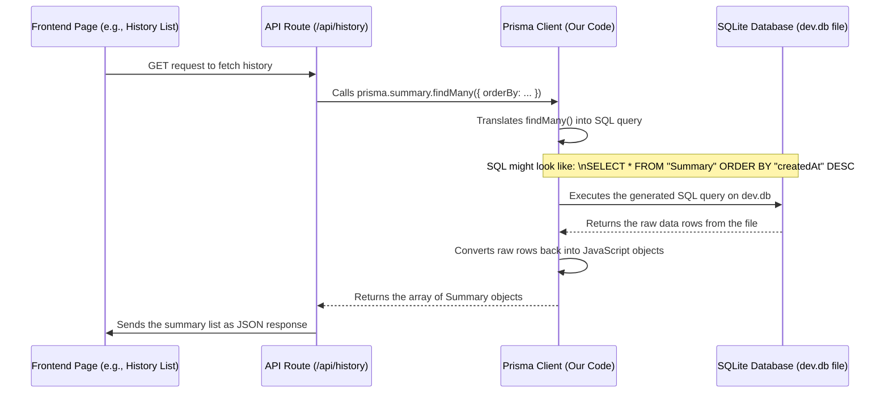

# Chapter 7: History Persistence (Prisma + SQLite)

Welcome back! In [Chapter 6: Prompt Engineering](06_prompt_engineering_.md), we learned how to craft precise instructions (prompts) to get the exact kind of summary we want from our AI models. We successfully generated a high-quality, structured summary!

But what happens to that summary once it's created? If the user closes the browser tab, is it gone forever? That wouldn't be very useful! We need a way to **save** these summaries so users can look back at their work later.

This chapter introduces **History Persistence** – our system for remembering past summaries. Think of it like a digital diary or logbook for our Youtube Summarizer.

## The Problem: Remembering Past Summaries

Imagine you use the summarizer for an important video lecture. A week later, you want to quickly recall the key points. You don't want to find the video URL again, type it in, select the options, and wait for the AI to generate the summary all over again! You just want to see the summary you already created.

This is where **persistence** comes in. Persistence means making data "stick around" even after the application is closed or the computer restarts. We need a place to store the summaries permanently.

## Our Solution: A Digital Logbook (SQLite + Prisma)

We'll use two main tools to create our "digital logbook":

1.  **SQLite:** This is our actual logbook. It's a very simple, lightweight **database**. Unlike big, complex databases that run on separate servers, SQLite stores the entire database in a single file right within our project (usually called something like `dev.db`). Think of it as a dedicated, organized notebook file just for our summaries.

2.  **Prisma:** This is our helpful librarian for the logbook. Prisma is an **ORM** (Object-Relational Mapper). That sounds fancy, but it basically means Prisma is a tool that helps our JavaScript/TypeScript code talk to the database (SQLite) in an easy, intuitive way. Instead of writing complicated database commands (SQL), we write simple JavaScript code, and Prisma translates it for us.

**Analogy:**

*   **SQLite (`dev.db` file):** The physical logbook (a file).
*   **Prisma:** The friendly librarian who knows exactly how to find pages (records) in the logbook, add new entries, or update existing ones, using simple instructions you give them in your language (JavaScript/TypeScript).

## The Blueprint: Defining What We Store (Prisma Schema)

Before we can save anything, our "librarian" (Prisma) needs to know what kind of information goes into our "logbook" (SQLite). We define this structure in a special file called `prisma/schema.prisma`. This file acts as the blueprint for our database table.

Here's a simplified look at the blueprint for our summaries:

```prisma
// prisma/schema.prisma (Simplified)

// Tells Prisma how to connect to the database (SQLite file)
datasource db {
  provider = "sqlite"
  url      = "file:./dev.db" // The path to our logbook file
}

// Tells Prisma how to generate the client code we use in our app
generator client {
  provider = "prisma-client-js"
}

// Defines the structure (the columns) for our 'Summary' table
model Summary {
  id        String   @id @default(cuid()) // Unique ID for each summary (like a page number)
  videoId   String   // The YouTube video ID (e.g., dQw4w9WgXcQ)
  title     String   // The title of the video
  content   String   // The actual summary text generated by the AI
  language  String   // Language of the summary (e.g., 'en', 'de')
  mode      String   // Style of summary ('video' or 'podcast')
  source    String   // Where the transcript came from ('youtube' or 'whisper')
  createdAt DateTime @default(now()) // When the summary was first created
  updatedAt DateTime @updatedAt // When the summary was last updated

  // Ensures we don't save multiple summaries for the exact same video AND language
  @@unique([videoId, language])
}
```

*   **`datasource db`**: Specifies we're using SQLite and where the database file (`dev.db`) is located.
*   **`generator client`**: Tells Prisma to create the JavaScript code (`Prisma Client`) we'll use to interact with the database.
*   **`model Summary`**: Defines a "table" named `Summary` in our database. Think of this like defining the columns in a spreadsheet.
*   **Fields (`id`, `videoId`, etc.)**: Each line defines a piece of information we want to store for every summary.
    *   `@id @default(cuid())`: Makes `id` the unique identifier for each record, automatically generated.
    *   `@default(now())`: Automatically sets `createdAt` to the current time when a summary is first saved.
    *   `@updatedAt`: Automatically updates `updatedAt` whenever a summary record is modified.
*   **`@@unique([videoId, language])`**: This is a crucial rule! It tells the database: "You cannot have two rows with the *same* `videoId` AND the *same* `language`." This prevents us from accidentally saving duplicate summaries for the same video in the same language. If we try to save a new one, we'll update the existing one instead (more on this next).

## Saving a New Summary (Adding an Entry to the Logbook)

Remember our "central kitchen", the [Summarization API Endpoint](04_summarization_api_endpoint_.md)? After the AI successfully generates the summary ([Chapter 6: Prompt Engineering](06_prompt_engineering_.md)), the API endpoint needs to save it to our logbook.

Here's how it uses Prisma (our librarian) to do this:

```typescript
// Simplified snippet from app/api/summarize/route.ts

import { prisma } from "@/lib/prisma"; // Import the Prisma client (our librarian)

// ... inside the POST handler, after 'summary' is generated ...

await writeProgress({ message: 'Saving summary to history...' });

try {
    // Ask the librarian (Prisma) to find if an entry already exists
    const existingSummary = await prisma.summary.findFirst({
        where: { // The search criteria
            videoId: videoId, // Match the video ID
            language: language // Match the language
        }
    });

    let savedSummary;
    if (existingSummary) {
        // If it exists, ask Prisma to UPDATE the existing entry
        savedSummary = await prisma.summary.update({
            where: { id: existingSummary.id }, // Find by its unique ID
            data: { // The new information to save
                content: summary, // Update the summary content
                mode: mode,       // Update the mode
                source: source,   // Update the transcript source
                // 'updatedAt' is updated automatically by Prisma
            }
        });
        logger.info('Updated existing summary in database', { id: savedSummary.id });
    } else {
        // If it DOESN'T exist, ask Prisma to CREATE a new entry
        savedSummary = await prisma.summary.create({
            data: { // The information for the new entry
                videoId: videoId,
                title: title,
                content: summary,
                language: language,
                mode: mode,
                source: source
                // 'id' and 'createdAt' are generated automatically
            }
        });
        logger.info('Created new summary in database', { id: savedSummary.id });
    }

    // Send the final summary (from the database) back to the user
    await writeProgress({
        type: 'complete',
        summary: savedSummary.content,
        // ... other details ...
    });

} catch (dbError) {
    // Handle cases where saving fails
    logger.error('Failed to save summary to database', dbError);
    // Maybe inform the user, but still send the summary back
    await writeProgress({
        type: 'complete',
        summary: summary, // Send the generated summary anyway
        warning: 'Failed to save summary to history.'
        // ... other details ...
    });
}
```

*   **`import { prisma } ...`**: We get access to our "librarian".
*   **`prisma.summary.findFirst({ where: ... })`**: We first ask Prisma to check if a summary for this *exact* video ID and language already exists in the `Summary` table.
*   **`prisma.summary.update({ where: ..., data: ... })`**: If an entry exists, we tell Prisma to update it with the latest summary content, mode, and source. Prisma finds the right record using its unique `id`.
*   **`prisma.summary.create({ data: ... })`**: If no entry exists, we tell Prisma to create a brand new one, providing all the necessary details (videoId, title, content, etc.).
*   **`try...catch`**: We wrap the database operation in a `try...catch` block. If something goes wrong during saving (e.g., database file issue), we log the error and inform the user, but we still try to send them the summary they generated.

This logic ensures that we either create a new history entry or update an existing one, preventing duplicates thanks to the `@@unique` constraint we defined in the schema.

## Viewing History (Reading from the Logbook)

Now that summaries are saved, how does the user see them? Our [Frontend Pages](01_frontend_pages__next_js_app_router__.md) need a way to fetch this stored data. We provide two dedicated API routes for this:

1.  **`/api/history`**: Fetches the list of *all* saved summaries (for the History dashboard page).
2.  **`/api/history/[id]`**: Fetches the details of *one specific* summary, identified by its unique ID (for the History detail page).

Let's see how these routes use Prisma.

**1. Fetching the List (`/api/history/route.ts`)**

This route needs to get all the summary records, usually showing the most recent ones first.

```typescript
// Simplified version of app/api/history/route.ts

import { prisma } from "@/lib/prisma";
import { NextResponse } from "next/server";

// Helper function to get a title (details not important here)
function extractTitleFromContent(content: string): string {
  // ... logic to find the title line in the summary content ...
  return "Extracted Title";
}

export async function GET() { // Handles GET requests to /api/history
  try {
    // Ask Prisma for all entries in the 'Summary' table
    const summaries = await prisma.summary.findMany({
      orderBy: {
        createdAt: 'desc' // Sort them: newest first
      }
    });

    // Process summaries slightly (e.g., extract title for display)
    const processedSummaries = summaries.map(summary => ({
      id: summary.id,
      title: extractTitleFromContent(summary.content), // Use helper
      createdAt: summary.createdAt,
      // ... maybe other needed list fields ...
    }));

    // Send the list back to the frontend as JSON
    return NextResponse.json({ summaries: processedSummaries });

  } catch (error) {
    console.error('Error fetching summaries:', error);
    return NextResponse.json(
      { error: 'Failed to fetch summaries' },
      { status: 500 } // Internal Server Error
    );
  }
}
```

*   **`prisma.summary.findMany({ orderBy: ... })`**: This is the key command. We ask Prisma to find *all* records (`findMany`) in the `Summary` table and sort them (`orderBy`) by the `createdAt` field in descending order (`desc`), so the newest summaries appear first.
*   **`extractTitleFromContent`**: A small helper used here to pull out the title line from the summary content for display in the list (the main point is the Prisma call).
*   **`NextResponse.json(...)`**: Sends the fetched list back to the frontend page that requested it.

**2. Fetching a Specific Summary (`/api/history/[id]/route.ts`)**

This route needs to get the full details of a single summary when the user clicks on an item in the history list. The `[id]` part of the route means it expects a unique summary ID in the URL (e.g., `/api/history/clwqvq78t00001234abcd`).

```typescript
// Simplified version of app/api/history/[id]/route.ts

import { prisma } from "@/lib/prisma";
import { NextResponse } from "next/server";

// Helper function (same as before)
function extractTitleFromContent(content: string): string {
    // ...
    return "Extracted Title";
}

// The 'params' object contains the dynamic part of the URL ([id])
type Props = { params: Promise<{ id: string }> }

export async function GET(request: Request, { params }: Props): Promise<Response> {
  try {
    const { id } = await params; // Get the specific ID from the URL

    if (!id) { /* ... handle missing ID ... */ }

    // Ask Prisma to find the ONE summary matching this unique ID
    const summary = await prisma.summary.findUnique({
      where: {
        id: id // The unique ID to search for
      }
    });

    if (!summary) {
      // If no summary with that ID was found
      return NextResponse.json({ error: 'Summary not found' }, { status: 404 });
    }

    // Prepare the data to send back (maybe extract title again)
    const responseData = {
        ...summary,
        title: extractTitleFromContent(summary.content), // Ensure title is present
    };

    // Send the single summary's details back to the frontend
    return NextResponse.json({ summary: responseData });

  } catch (error) {
    console.error('Error fetching summary:', error);
    return NextResponse.json(
      { error: 'Failed to fetch summary' },
      { status: 500 }
    );
  }
}
```

*   **`await params`**: Extracts the `id` value from the URL path.
*   **`prisma.summary.findUnique({ where: { id: id } })`**: The core command here. We ask Prisma to find the *single* (`findUnique`) record in the `Summary` table whose `id` matches the one provided in the URL.
*   **Error Handling**: Checks if a summary was actually found and returns a "Not Found" (404) error if not.
*   **`NextResponse.json(...)`**: Sends the full details of the found summary back to the frontend.

## How Prisma Talks to SQLite (Under the Hood)

You might wonder how Prisma turns simple JavaScript like `prisma.summary.findMany()` into something the SQLite database file understands.

Prisma acts as a translator. It takes your high-level request (written in JavaScript/TypeScript using the Prisma Client) and converts it into low-level database commands (SQL - Structured Query Language) that SQLite can execute directly on the `dev.db` file.

Here’s a simplified flow:



You don't need to write or even understand SQL! Prisma handles the translation automatically, letting you work with your database using familiar JavaScript concepts.

## Conclusion

You've learned how our Youtube Summarizer implements **History Persistence** using **Prisma** and **SQLite**:

*   **Persistence** allows us to save data (summaries) so it's not lost.
*   **SQLite** provides a simple, file-based database (`dev.db`) to store the data.
*   **Prisma** acts as an ORM ("librarian"), making it easy for our code to talk to SQLite using JavaScript/TypeScript.
*   The **Prisma Schema (`schema.prisma`)** defines the structure of our `Summary` data table.
*   We use `prisma.summary.create` or `prisma.summary.update` in the [Summarization API Endpoint](04_summarization_api_endpoint_.md) to save summaries.
*   Dedicated API routes (`/api/history` and `/api/history/[id]`) use `prisma.summary.findMany` and `prisma.summary.findUnique` to retrieve history data for the frontend.
*   Prisma translates our code into SQL for SQLite automatically.

This setup provides a robust yet simple way to keep track of all the summaries generated by users.

Now that our application can generate summaries, retrieve transcripts, handle different AI models, and save its work, how do we package it all up so others can easily run it on their own machines or servers? That's where containerization comes in!

Next up: [Chapter 8: Deployment Configuration (Docker)](08_deployment_configuration__docker__.md)

---

Generated by [AI Codebase Knowledge Builder](https://github.com/The-Pocket/Tutorial-Codebase-Knowledge)