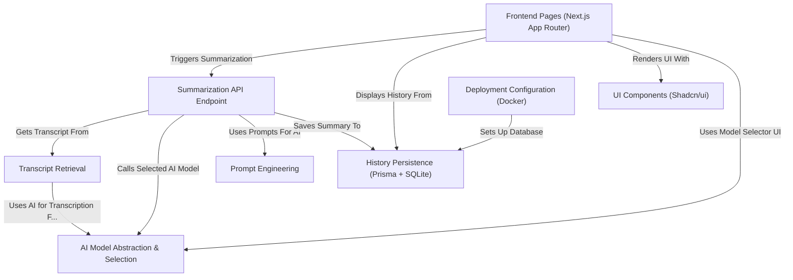

# Tutorial: Youtube Summarizer

This project is a web application that uses **Artificial Intelligence (AI)** to create summaries of *YouTube videos*.
You simply provide a video link, choose options like the desired *language*, *summary style* (video or podcast), and the specific *AI model* (like Gemini, Groq, or GPT-4).
The application then fetches the video's transcript (or generates one if needed), processes it with the selected AI, and displays a structured summary.
It also keeps a **history** of your past summaries, stored in a local database, so you can easily revisit them later. The user interface is built using modern web technologies for a smooth experience.

**Source Repository:** [https://github.com/DevRico003/youtube_summarizer](https://github.com/DevRico003/youtube_summarizer)

## Chapters

1. [Frontend Pages (Next.js App Router)
](01_frontend_pages__next_js_app_router__.md)
2. [UI Components (Shadcn/ui)
](02_ui_components__shadcn_ui__.md)
3. [AI Model Abstraction & Selection
](03_ai_model_abstraction___selection_.md)
4. [Summarization API Endpoint
](04_summarization_api_endpoint_.md)
5. [Transcript Retrieval
](05_transcript_retrieval_.md)
6. [Prompt Engineering
](06_prompt_engineering_.md)
7. [History Persistence (Prisma + SQLite)
](07_history_persistence__prisma___sqlite__.md)
8. [Deployment Configuration (Docker)
](08_deployment_configuration__docker__.md)

---

Generated by [AI Codebase Knowledge Builder](https://github.com/The-Pocket/Tutorial-Codebase-Knowledge)